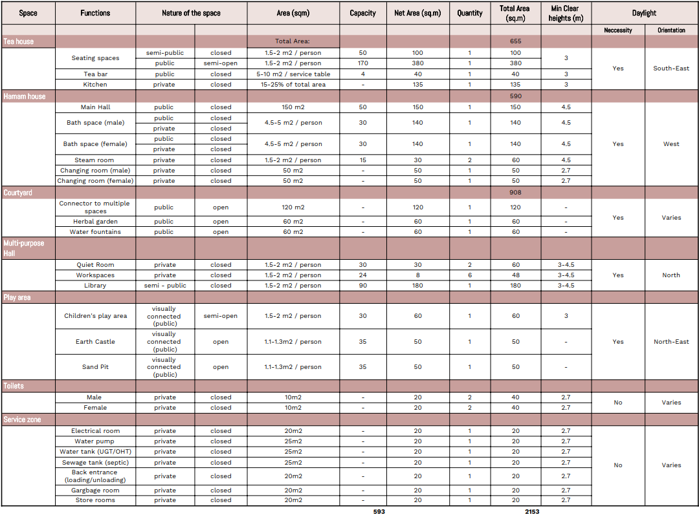
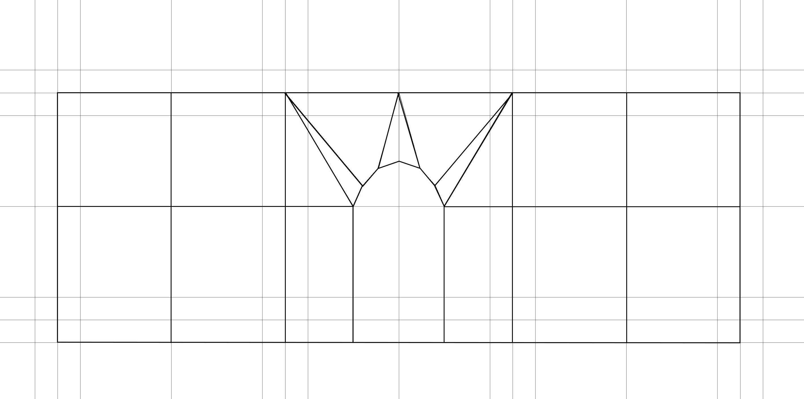
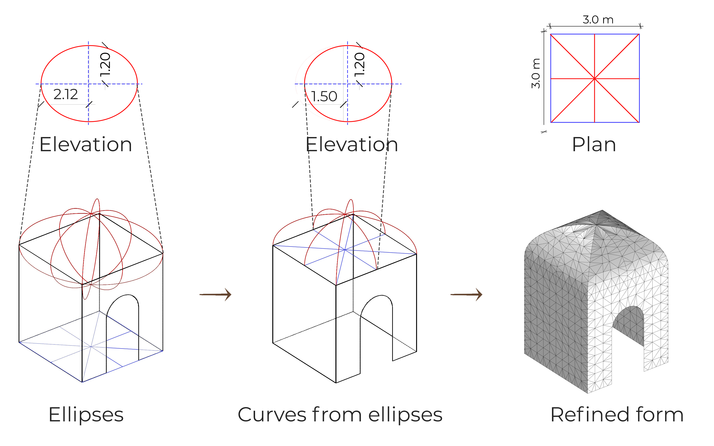
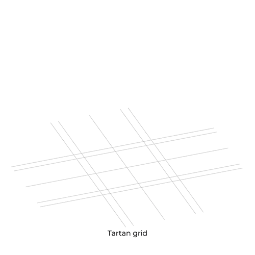
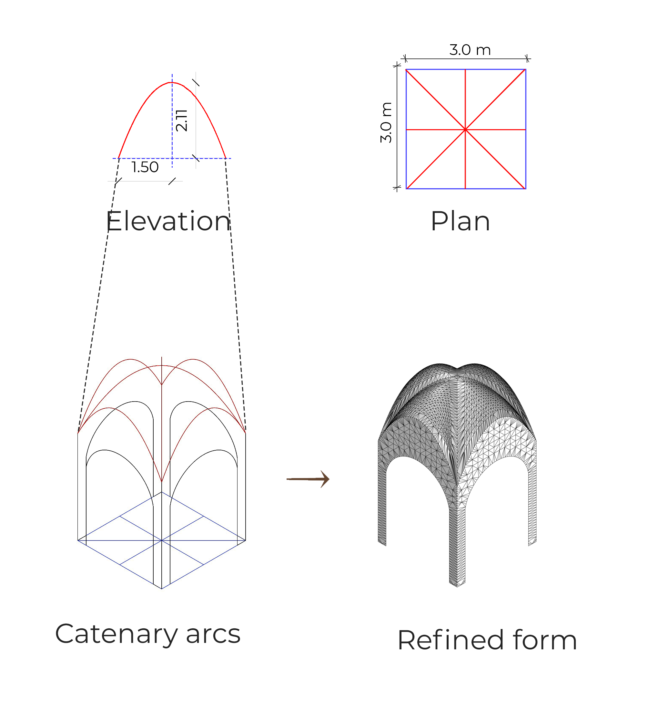
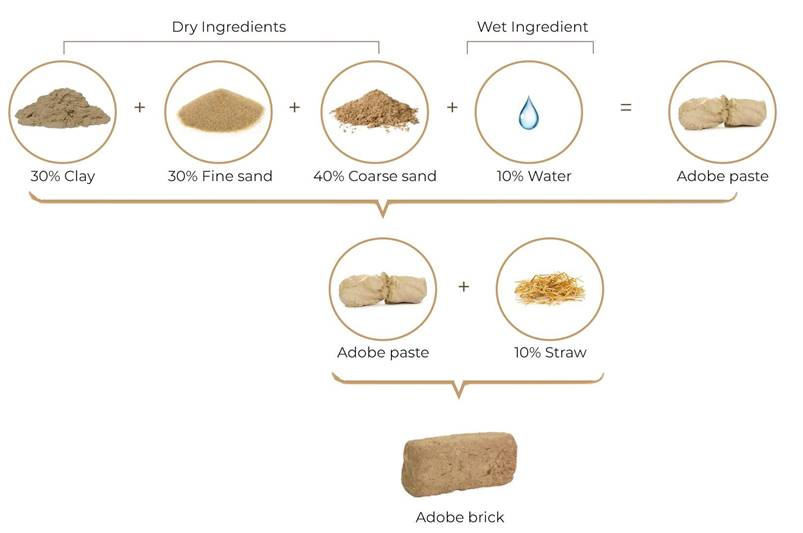
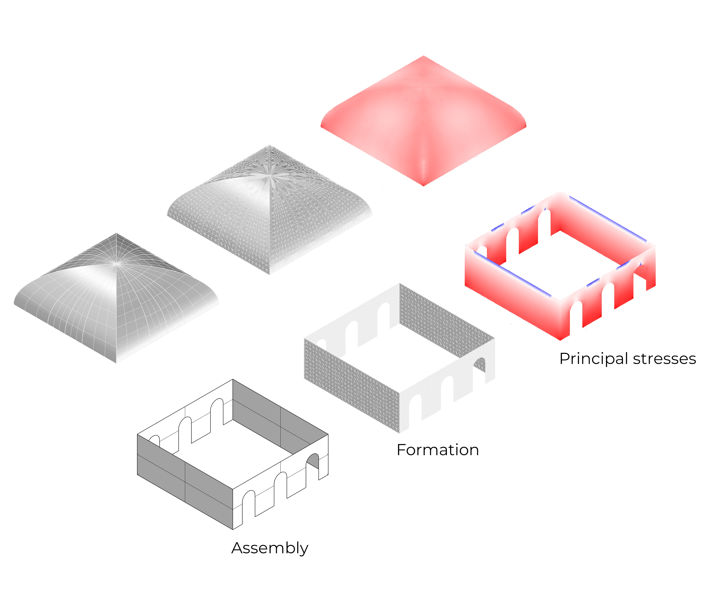

## 0_Introduction *Beza*
general text about the project and brief of the project.(also talk about the site)
leading to the problem statment

### About Zaatari
text text site study

### Problem statement
talk about the problems we hope to tackle

### Design goal
xxxxxx intervention

### Design vision
ssssss Ease construction due to unskilled whatever else

### Overall flow chart
This flowchart shows the overall procedural workflow adopted for designing Raha. The whole project is divided into four stages, Congifuration, Forming, Structuring and Constructability respectively. 

The larger division of stages offers an eventual progression of the design by keeping each stage in coherence and informed with the other to achieve a generative design. 

---

## 1_Configuration
introduction explaining the configuring phase and its goals.(from course brief)*Anagha*

### Site selection *Beza*
*flowchart*  
Course Brief's demand @Beza please cover these points: *Analysis: Analyse the site in terms of intensities of population, activities, highlighting the infrastructure and seeking to reveal the invisible connections as well as flows of people and goods between points of interest.
Synthesis: Interpret the analyses and put them together to form a conclusion regarding how things work right now.
Evaluation: Identify the missing buildings and the connections that need to be strengthened or improved.
Proposition: Propose a list of communal buildings or mega buildings (such as bazars) to be designed and then envision and list stages of spatial improvements that can be feasibly realized by the community.*  

*beza's gif*  
explaining how we came to the selection of this site. Explain with apt conclusion why district 9 was chosen, link it to the site study.  

*Twinkle*  
Explain the site surroundings and site orientation, add a google map/diagram - wind and sun path (brief study) 

### Program of requirements *Thijmen*  

[Click here to open the PDF](rev/configuration/Program_of_requirements.pdf)  

Having selected a site to fit the Raha building a program was developed.  
with the functions that are to be hosted in the building came also some demands on capacity, size, level of privacy, and desire for daylight. Below these choices will be explained.

<ins>Tea house</ins>  
The tea house is one of the main functions of Raha. Its purpose is to connect people and provide them with a place where they can meet and socialize.
To do so there will be two seating spaces, a public one and a private one to allow for more intimate conversations. Together they will have a capacity for 150 people. They will be located ad the southeastern part of the building to have propper daylight which helps create the ambiance required. 

There will also be a tea bar and kitchen located in this area to provide visitors with food and drinks. These functions will have to be close to a separate entrance for them to be provided with supplies. Daylight is a necessity in the kitchen but it would help to reduce the need for artificial light.

To make sure that visitors with kids are also welcomed there will be an indoor and outdoor play area for the children.

All of these functions will be connected with a courtyard, named the herbal garden this courtyard can provide herbs for the tea that is being served in the tea house. Visitors are welcome to help with the gardening of this garden.  
There will also be some toilets connected to the herbal garden.

<ins>Hammam</ins>  
The hammam is a more secluded part of the Raha building, it is there to provide comfort hygiene for male and female the layout of the hammam will be the same and as follows.  
From the Waterbody courtyard, you enter the main hall and entrance of the hammam.
Where you can get your towels and go through to the changing room to continue either to the steam room, or the public or private bath spaces.  
All of these rooms require good ventilation and daylight but are private so this should be taken into account when designing said room.  
The hammam as a whole can host up to 125 people.

<ins>Quiet area</ins>  
Also located next to the waterbody courtyard is the quiet area. The quiet area hosts the next functions.
The quiet rooms where people can come, sit, read, and enjoy a quiet space.
There is also a library to provide visitors with books to read.
And several workspaces for the visitors to use.

All of these rooms require daylight but it should not be disturbing this is why a north orientation is chosen for these rooms.  
There will also be toilets connected to the waterbody courtyard.

<ins>Entrance</ins>  
Of course the project needs an entrance, when entering the site visitors will first walk into the water fountain courtyard. From which they can choose to go to the waterbody courtyard or the herbal garden courtyard.

<ins>Service zone</ins>  
To provide all the functions from there required services like heating, water, power, storeroom, etc. There will be a service zone that has his separate entrance and is connected to the hammam, tea house, and water fountain courtyard.

### Connectivity of spaces
After deciding which functions should be in the project to achieve our vision the relations between these functions were studied. To do so we went through the next steps multiple times untill the the project relations were coherent.  

**Rel chart**  

The REL chart shows the relationship a certain function or room has with every other function or room. In the beginning, assumptions were made on which function should be connected to which other function. By analyzing the results this chart was changed to make sure it provided a better input for our syntactic tool.

**Bubble diagram**  
Taking the REL chart created in the previous chapter the connections were analyzed using a bubble diagram.  
Starting with the syntactic tool for Rhino Grasshopper.
To make the process of checking and rechecking more automated rather than building a new bubble diagram each time. A script was created to generate points and their connections based on the connections in the REL chart.
\
Dots and lines generated by the output of the REL chart, this will be input for the syntactic tool.\
\
The script is used for generating the lines between the dots, based on the value implied in the REL chart.\
\
This bubble diagram was studied and connections were moderated if necessary. However, it did not provide us with the clear bubble diagram that we were expecting from the program. So we converted it into a manual bubble diagram. This also gave us the option of giving a certain weight to the connections as is shown below.\
\
Final bubble diagram.

**Hierarchy of spaces**  
*Thijmen*  
<ins>*Depth chart*</ins>  
show depth chart explaining the logic behind it

<ins>*Metro link diagram*</ins>  
showing and explaining

### Summary or conclusion
*First do the rest*  

---  

## 2_Forming
introduction explaining the configuring phase and its goals.(from course brief)*Anagha*

### Spacial configuration

**Gradient descent optimization**  
*Anagha*  
Video/gif, excel, flowchart of the script and explanation
in 2D

**3D Study**  

*Fig: 3D Visualisation of connectivity of spaces*

It was neccessary to analyse the 2D configuration in a 3D space to determine the adjacencies and connectivity in the horizontal and the vertical plane. The outputs generated from the computational tool were used as an input for this study.

First step was to study the ratio between the built v/s unbuilt spaces and define the proportions of the unbuilt spaces depending on the widths of the adjacent built spaces.
Next step was to connect the built and the unbuilt spaces and understand the nature of the connection. This was determined by analyzing if the connection was an exterior, interior, horizontal or vertical connection. Once the connections are defined, the walls were extruded. Certain spaces like the quiet rooms, workspaces and the sheesha were placed on the first floor as the nature of the space determined it's position. As the quiet rooms and the workspaces required a quiet and calm environment and the sheesha required an open to sky configuration, the spaces were placed on the first floor.   

### Configured design

**Modular grid**    
*Twinkle*  
talk about the grid 1.2m we first choose and how it transformed into the tartan grid explain why initially bands of 600mm was assumed- based on last years reference and our room sizes. 

**Floor plans**  
show (general) floor plans and there plan evolution (study on the courtyards and therfore the configuration that was informed)
*Siteplan*  
showing the site plan of the building and its surrounding, and the orientation (start with the first one and show how it evolved)  

**Wall modules**  
explain how the walls have been designed according to the tartan grid.
including the change of wall tickness (why we choose for 600mm bands in the tartan grid)

**roof modules**  
talk about Architectural charactaristics and show the different roof modules in the plan view - 4 types Crossvaults, Square domes, Rectangular domes and Domes with Skylight
talk about how these roofs have been designed using the tarten grid

**Sections**  
show sections and explain the heights etc

**details**

<ins>*Services*</ins>  

<ins>*Ventilation*</ins>  

<ins>*Detailed section*</ins>  

 
### Summary or conclusion

---

## 3_Structuring 
 
Introduction explaining the configuring phase and its goals.(from course brief)*Anagha*

### Tesellations

*Fig: Tessellation process flow chart*

**Exploration**

<ins>*Manual*</ins>   
*Shriya and Beza*  

*Fig: Exploration of different meshing techniques*

The form finding was determined by the study of architectural characteristics of different spaces. To start the process and understand how different meshes gave different shapes, a thorough literature study was conducted. During this process, we considered a roof form and it's corresponding size, and manually meshed the initial divisions. The initial divisions followed a logic which was derived from the literature research. Different types of meshing logic was explored initially and were imported in the kangaroo solver to generate the dynamically relaxed form. Different meshing logic gave a different result, for example, the quad split logic generated a curved peak while the triangulation logic generated a pointed peak. This step was repeated for every type of meshing logic and the triangulation meshing logic was chosen as it closely resembled the desired form. Later these meshes were imported in the kangaroo solver to sub divide the initial meshes and generate the dynamically relaxed form. 

Explain the different types of tesselations (dome/cross vault Jpegs) and meshing logic/strategy

<ins>*Computational*</ins>  
*Thijmen*  
Explain the mesh maker 4000, flowchart and the dynamic relaxation strengths and anchors, etc per module - total number of modules 7 + 1 (3- square domes, 3 rectangular domes,1 cross-vault, +1 is dome with skylight (Adobe 2.0))  
Mention the challenge with dome with Skylight and why it wasnt possible to relax an opening within the dome.

**Final Tesselation**  

<ins>*Roof*</ins>   

 
*Fig: Showing the initial roof tessellations*

As the triangulation meshing logic was chosen initially, after dynamically relaxing the meshes, we realized that the form generated failed to perform well structurally. The dynamically relaxed roof did not transfer the loads uniformly and developed peak tensile stresses at the edges of the walls. Moreover, the meshing logic did not work well for larger spans as it generated fairly flat surface at the top of the dome which gave rise to peak tensile stresses at the highest points of the roof.

     
*Fig: Showing the final roof tessellations from wall centerlines*

   
*Fig: Showing the final roof tessellations seperated by the wall thickness*  

The final tesselation logic was a combination of constant quad split and triangulation method. This logic was structurally analyzed and worked well structurally as the load distribution was uniform and peak tensile stresses generated were considerable. Moreover, this logic closely resembled the desired form and maintained the form irrespective of the span.

<ins>*Walls*</ins>  

*Fig: Wall tessellations* 

Though a computational method was used for the roofs, for the walls we opted a manual approach. The meshes for the walls were generated using the initial divisions of the roof mesh. The intersecting points between the roof and the wall determined the mesh lines for the walls. These mesh lines became the guideline for the division of the arched opening in the wall. A similar mesh logic was applied in the wall meshing as done for the roof meshes; constant quad split and triangulation method. Once the walls with the openings were meshed, walls without openings followed the mesh lines of the later. After the initial meshing of the walls, they were imported to weaverbird in grasshopper to sub divide the initial meshes and make the meshes more coarse and match them with the roof meshes. 

**Simplification**  

<ins>*Square domes*</ins>

*Fig: Evolution of the dynamically relaxed form*

In order to achieve a smooth form and for the ease of construction, the dynamically relaxed form was refined further. The inital tesselataion, based on the tartan grid, was approximated and simplified to the closest curve resembling the generated mesh. These curves were used to build the final surface of the roof which was later analyzed in karamba 3D for structural calculations. 

*Fig: Simplification logic of Square domes*

The dynamically relaxed form was refined under a specific geometry in order to ensure accuracy in construction. Each curve of the form was re-drawn to the closest ellipse. These ellipses were made using the edge points of the meshes and then cut into half to derive the elliptical curves. For the square domes, two types of ellipses were used: one ellipse in the vertical and horizontal direction and one for the diagonals. The final surface was generated using these elliptical curves and imported to weaverbird in grasshopper for further refinement.

*Fig: Simplification logic of Square domes*

This logic was repeated for the other square domes: 6 x 6 M and 9 x 9 M. The curves were scaled twice for the 6 x 6 m dome and thrice for the 9 x 9 m dome. In case of 9 x 9 m dome, additional curves were drawn to match the initial tesselations and for structural stability.

<ins>*Rectangular domes*</ins>

*Fig: Evolution of the dynamically relaxed form*

Similar logic was applied for the rectangular domes.

*Fig: Simplification logic of rectangular domes*

In case of rectangular domes, two different ellipses were made. One ellipse was made in the center dividing the top ridge into 2 parts and the second ellipse was drawn from the corners of the rectangle, creating a slight curvature on the smaller sides of the ceiling.

*Fig: Simplification logic of rectangular domes*

This logic was repeated for the other rectangular domes domes: 6 x 3 M and 9 x 6 M. The curves were scaled twice for the 6 x 3 m dome and thrice for the 9 x 6 m dome. In case of 9 x 6 m dome, additional curves were drawn to match the initial tesselations and for structural stability.

<ins>*Cross vaults*</ins>

*Fig: Evolution of the dynamically relaxed form*

The dynamically relaxed form was refined under a specific geometry in order to ensure accuracy in construction. Each curve of the form was re-drawn to the closest catenary arc. These arcs were made using the edge points of the meshes and then cut into half to derive the catenary curves. For the cross vaults, only one catenary arc was used to generate the surface. The final surface was generated using these elliptical curves and imported to weaverbird in grasshopper for further refinement.

*Fig: Simplification logic of cross vaults*

**Material Selection**  

Due to the change in the course structure due to Covid-19, material research and testing was not part of the brief. We referred to the tests and anlaysis done by the previous year students of the same course. We primarily considered the test results of Bustan group (Group 5) and chose the same materials and material limit states for our project.  

*Fig: Material composition*

The adobe bricks should be made by the refugees at the camp site with the available materials. The recipe for the standard brick composition were 30% clay, 30% fine sand, 40% coarse sand and 10% water of the total weight of the dry ingredients. Additionally, straw was chosen as an addition to the adobe paste to improve the tensile strength of the brick. The straw was added in the percentage of 10% of the total mixture. The final mixture was then placed in the required moulds and allowed to dry to make the bricks. The mortar was also prepared with the same basic composition with higher percentage of water as required to make the sticky paste. (Bustan,2019)

*Fig: Design Values*

The limit states of the material were obtained from a research paper (Clifton, J. R., & Davis, F. L., 1979.) and Last year's material report written by Bustan group (group 5). From the literature study (Clifton, J. R., & Davis, F. L., 1979) we concluded that safety factor within the range 1.2-2 is ideal in this case. In case of addtional floors above, safety factor of 4 was considered.  

**Strcutural Analysis**

*Fig: Structural analysis process flow chart*

<ins>*Process*</ins>

*Fig: Initial approach for structural analysis of the structure*

Structural analysis of the generated geometry was implemented in Karamba 3D in grasshopper. The structural analysis process was carried out in 2 stages. In the first stage, the chosen dynamically relaxed form was placed over the vertical base after which the wall and the roof meshes were merged to form a uniform mesh. This uniform mesh became the input for the karamba analysis. 

It was observed that the load distribution was not uniform as we observed peak tensile stresses at the edges of the wall and irregularity in the load distribution in the roof. This was due to irregular surfaces and meshes generated from dynamic relaxation. Moreover, the ridge between the wall and the roof was visible distinctly, therefore, the wall and the roof meshes were not coherent.

*Fig: Final approach for structural analysis of the structure*

In the second stage, the simplified surface of the wall and the roof was chosen for further analysis. In this case, the wall and the roof were analyzed separately. First the roof was analysed using the simplified geometry. The reaction forces from the roof were given as an input to the wall analysis along with the self weight of the wall. The wall was then analyzed. 

It was observed that the load distribution was uniform and the meshes were coherent. The peak stresses developed at the edges and the corners of the wall were within the set limits and the transition between tension and compression was logical and regular. High compression at the bottom of the wall and at the top of the roof and tension at the corners and the edges of the wall determined the analysis was performed correctly. Moreover, the analysis proved that the roof can be made into a completely compression roof which fulfilled the ultimate goal.

<ins>*Module_1*</ins>

*Loadcases:*
Explain the load coonditions considered

*Support conditions*

*Results*

*Verification*

<ins>*Module_2*</ins>

*Loadcases:*
Explain the load conditions considered

*Support conditions*

*Results*

*Verification*

<ins>*Module_3*</ins>

*Loadcases:*
Explain the load coonditions considered

*Support conditions*

*Results*

*Verification*

<ins>*Module_4*</ins>

*Loadcases:*
Explain the load coonditions considered

*Support conditions*

*Results*

*Verification*

<ins>*Module_5*</ins>

*Loadcases:*
Explain the load coonditions considered

*Support conditions*

*Results*

*Verification*

<ins>*Module_6*</ins>

*Loadcases:*
Explain the load coonditions considered

*Support conditions*

*Results*

*Verification*

<ins>*Module_7*</ins>

*Loadcases:*
Explain the load coonditions considered

*Support conditions*

*Results*

*Verification*

<ins>*Module_8*</ins>

*Loadcases:*
Explain the load coonditions considered

*Support conditions*

*Results*

*Verification*

### Summary or conclusion  

---
## 4_Constructability

Introduction explaining the construction phase and its goals.(from course brief)*Bez*

**Methodology**   

<ins>*relationship between different modules*</ins> 
*Beza*  
Explaining the scalable difference between each module, therfore each curve is double of the other, Mention how they are Different yet similar a the same time. 

<ins>*Rib system approach*</ins>  
*Beza*  
Selection of construction using ribs + infill method

**Interlocking bricks**  

<ins>*system exploration*</ins>   
*Beza and Twinkle*  
The different interlocking systems researched refer to appendix when neccessary to ensure that the information here is not too much. then add teh table ranking the different interlocking systems studied and tehrefore choosing the one we did

<ins>*design process*</ins> 
*Beza*

*Manual study*
*Beza*
Starting from the circular arch to the elliptical arc taht forms the Dome ribs.

*Computational tool development*  
*Thijmen*  
Flowchart of the script
Include the GIF
The adaptation of the tool for various modules

*Experiment*  
*Twinkle and Anagha*  
Add video and talk about teh brick infill making and 3d printing of the blocks

<ins>*Construction instrument*</ins>   
*Twinkle*  
*General concept and deisgn of the tool*  

*Adaptation to different modules* 

**Adobe 2.0** 

<ins>*Design concept*</ins>  
*Twinkle*   
mention fibonacci and the twist in the dome that creates the lamela dome look 

<ins>*Computational tool*</ins>  
*Anagha*  
Script flowchart Include the GIF and explanation. 

<ins>*Construction instrument*</ins>   
*Twinkle*    
*General concept and deisgn of the tool*  

**Brick Library**  
*Twinkle*  
Brick sizes and weights to be justified for constructability -  Brick Library with dimensions weights and moulds - which one is used where (which module)
In a 3D view colour code and nomenclate the bricks used per module

<ins>*construction sequence*</ins>   
*Beza*  
All the lovely Gifs and explanation of the process it selft
Foundation to walls to window/door openings and therefore roof modules

*Square domes*  
Gif.
3d image of the brick colour and nomenclature   

*Rectangular domes*  
Gif.
3d image of the brick colour and nomenclature   

*Cross vaults*  
Gif.
3d image of the brick colour and nomenclature  

*Adobe 2.0*  
Gif.
3d image of the brick colour and nomenclature  

### Summary or conclusion

---

## 5_Conclusion

---
## 6_Reflection

While going through the process of designing an earthy building as is being explained above a lot was learned. Below each group member will reflect on the process and how they have experienced it.

**Anagha Yoganand**

reflection

**Bezawit Z. Bekele**

reflection

**Shriya Balakrishnan**

reflection

**Thijmen Pluimers**

reflection

**Twinkle Nathani**

reflection
