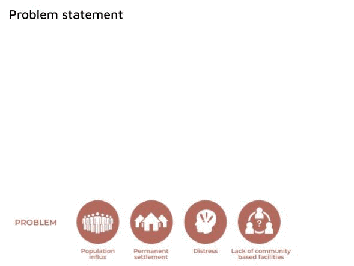
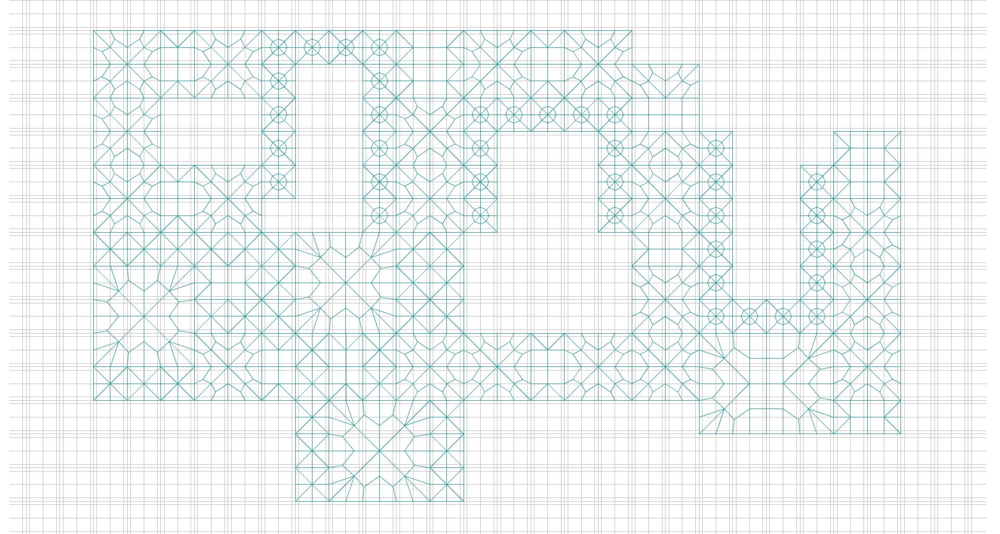
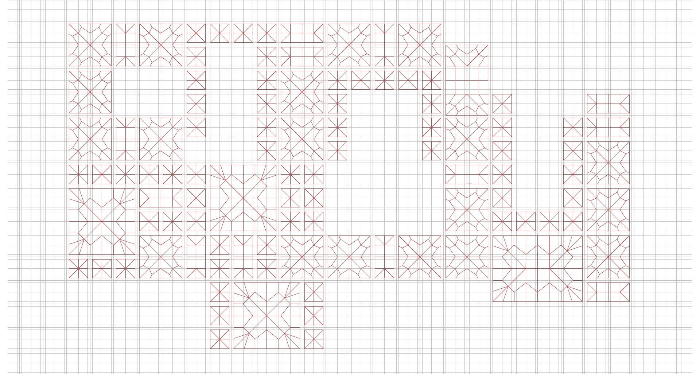
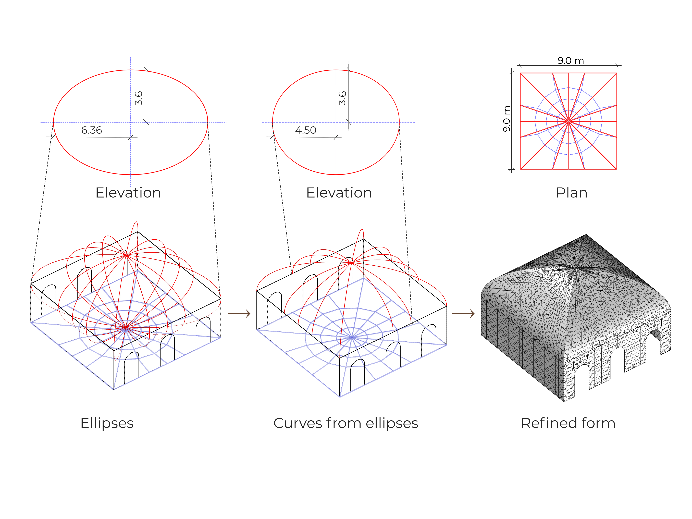
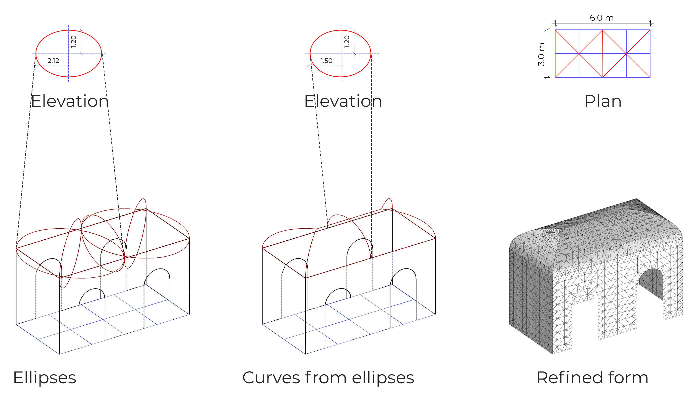
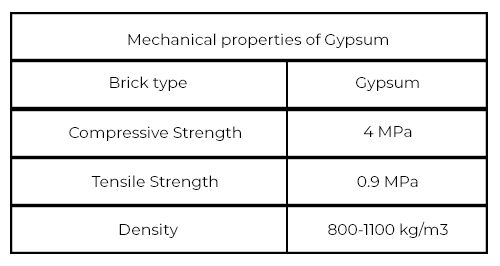
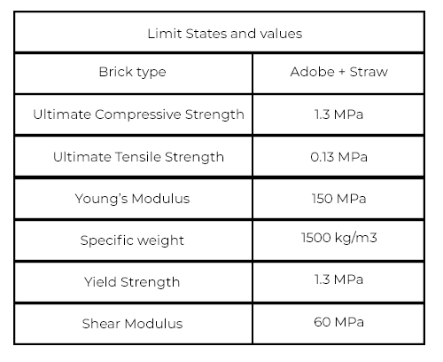
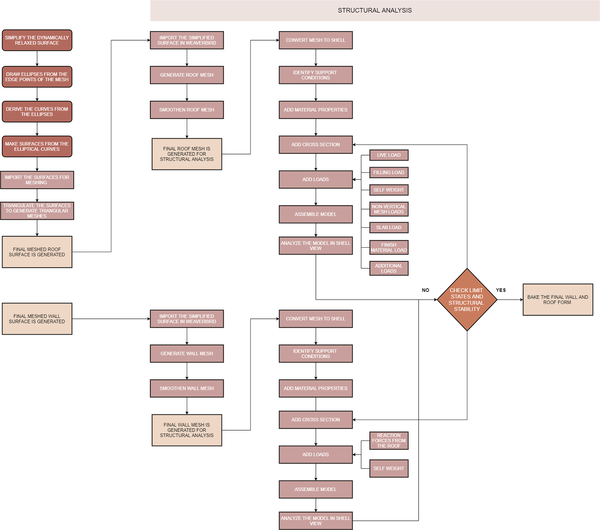

## 0_Introduction *Beza*

This site documents the design process of RAHA, a recreational center designed within the boarders of the Zaatari camp. RAHA is an Arabic word meaning comfort, rest or relaxation; it is also an acronym for recreational activity hub actuator. The intention behind the design of the building is to create a recreational facility where the refugees in the camp can interact with one another while participating in culturally relevant activities. The recreational hub contains programmatic functions that allows for the refugees to relieve their stress and engage in informal counselling and therapeutic activities. While the social objectives are to re-introduce a sense of normalcy for the camp residents; the design of the building explores the use of computation for creating 21st C earth buildings. 

The design process is explained in 4 stages: Configuring, shaping, structuring and Constructability. The configuration stage starts with identifying a problem that can be addressed by a missing building on a selected site followed by defining the programs and their co-responding relationship. In the shaping phase, the form finding of the building is studied where different roof tessellations are explored. This is followed by the structuring phase where the building form is structurally analyzed using karamba. In line with the structuring phase, the ease of construction was studied where different construction methods and sequences are tested. Based on the design progression, the final output is presented with the chosen construction method and defined bricks and modules. 

### About Zaatari

The zaatari camp is the largest camp for Syrian refugees set up in Jordan following the breakout of the Syrian civil war in 2011. The camp started operating in 2012 admitting 15,000 refugees by August 2012. The number of refugees in the camp increased over the years to a staggering 78,357 by October 2018. During this time, the camp evolved from a small collection of tents into a permanent urban settlement. 

The camp is divided into 12 districts, there are 32 schools and 52 community centers. Presently the UNHCR coordinates the infrastructure improvements and shelter assistance within the camp along with the provision of energy supply. There are pre-fabricated shelters including latrine and kitchen. 

### Problem statement

The zaatari camp houses a large number of Syrian refugees. Although the camp was set-up as a short-term accommodation the ongoing war has prolonged the duration to a latent permanency. As a result, long-term solutions are required not only in accommodation but also by providing adequate and culturally relevant community-based facilities that also work towards informally addressing underlying issues related to the holistic well-being of the refugees.

Refugees residing in the camp come from a war ridden place, they have had traumatic experiences most of which have lost loved once and left loved ones behind. Research shows various distresses reported among refugees including avoidance, anger, helplessness, fear and reduced functioning. The various types of distress result in the deterioration of the refugee’s mental well-being and hinder their chance of having a stable normal life. As the number of residents within the camp continue to increase and extend their temporary stay; the facilities in the camp are rendered incapable to cater to the needs of the incremental population. Therefore, it is essential to have centers geared towards relieving their distress and creating a better living environment within the camp. 

### Intervention

For the refugees to be re-integrated to a sense of normalcy, a vast array of facilities must be incorporated within the camp.

The proposed intervention is to introduce a “recreation hub” including a tea house, a hammam, a play area for children and connecting courtyards with herbal gardens. The proposed function is a culturally relevant community based “recreation hub” where the spaces allow for various levels of human interaction, activities and informal counseling. These spaces will be correlated based on a multilayer programmatic requirement considering the area, climatic needs, visual connections and zoning of the public-private spaces.

### Design vision

The design vision is to create a “recreation hub” hosting social spaces with partly interchangeable functions, which have comfortable indoor climates by learning from vernacular architecture and utilizing appropriate building technology that allows for efficient use of space, limited resources and ease of constructability.

### Design questions

1. What are the site conditions?  
•	What is the climatic condition?  
•	What is the population size?  
2. Where should the “recreation hub” be located?  
•	What is the built-unbuilt relation?  
•	What resources are available?  
•	What facilities are present?  
3. What are the programmatic needs of the “recreation hub”?  
•	Which programs are culturally relevant and fit the site context?  
•	What is the area requirement of each program?  
4. How should the different programs be spatially configured?  
•	What is the public-private zoning requirement for each program?  
•	What is the level of enclosure required for each program (closed, open, semi-open)?  
•	What type of indoor comfort is required for each program?  
•	What type of visual connection or circulation is required between different programs?  
5. What are the architectural characteristics requirement for each space?  
•	How are these characteristics translated into the building form?  
6. How should the roof tessellations be configured?  
•	What type of tessellations result in the desired architectural characteristic?  
•	Which tessellations of the roof need to match?  
•	How do the tessellations relate to the grid?  
•	How many different roof modules are present?  
•	How can the roof be simplified to closely match the tessellations?  
7. Is the designed form structurally stable?   
•	In what way do the roof tessellations need to be modified?  
•	What are the wall thicknesses required in different parts of the building?  
•	Are the loads transferred uniformly?  
8. Which construction system can be easily be done with unskilled laborer’s?  
•	What type of construction system can be used for the varying modules?  
•	What type of bricks, molds, formwork are required?  
•	What resources and material are available?  
•	What is the construction sequence?  

### Overall flow chart
This flowchart shows the overall procedural workflow adopted for designing RAHA. The whole project is divided into four stages, Configuration, Forming, Structuring and Constructability respectively. The larger division of stages offers an eventual progression of the design by keeping each stage in coherence and informed with the other to achieve a generative design.

INSEERT FLOW CHART HERE

The first part is configuring followed by shaping and structuring. In the configuration phase: based on the identified problem and proposed intervention; the main programmatic functions were defined. A set of rules were developed to select the site after which the program relationships were developed using bubble diagrams ands REL charts. These were computationally mirrored using a phyton script and a syntactic tool. Further relationships were studied using metro-link diagrams and depth graphs. Based on the outcome, the study was translated to a concept plan which was further developed computationally using gradient decent optimization. Following these studies the floor plans were formulated. 

In the shaping process, the required architectural principles for each space was ranked based on set priority criteria to inform the form finding process. Based on this, different dynamically relaxed roof tessellations were studied after which roof and wall modules were defined. 
Based on the defined modules, the structuring phase starts with simplification of the tessellated roofs. The simplified roof surfaces are meshed and structurally analyzed on karamba. Here the material properties and cross sections are defined. Based on the results of the structural analysis the roof tessellations and wall thicknesses are optimized for best results. 

The constructability was studied along with the structuring phase. Different construction systems are analyzed and ranked based on ease of construction and adaptability to the different modules. The materials available on site are studied for potential to aid the construction system. The chosen system is further developed computationally and further studied with a physical model. The brick sizes and modules are defined. The construction system and sequence are developed along with required formwork. 

## 1_Configuration
introduction explaining the configuring phase and its goals.(from course brief)*Anagha*

### Site selection *Beza*

INSERT FLOW CHART HERE

As per the proposed intervention of building a recreation hub, the main programmatic functions are a tea house, a hammam, quiet space with library, and a play area for children with connecting courtyards housing herbal gardens and water bodies.  To select the site the points of consideration are unbuilt spaces, water resource, proximity to other facilities such as schools and kindergartens and the distance from the main road. As the recreation hub includes a hammam, locating it near a water resource is essential. The recreation hub also includes a quiet space with library, a children’s playground which can be an extension to existing schools, youth centers and kindergartens. 

To select the site, a computation tool was created that first identifies built/ unbuilt space and road networks. The tools select the empty plots on the site. These plots are further filtered by size taking only in-between spaces of larger sizes.  Then the existing water resources are mapped. Open spaces that fall within 250 m of the existing water resource are selected. The existing schools, youth centers and kindergartens were mapped and the site selection was further narrowed down to open spaces within 100m of the mapped centers. From the remaining list, hierarchical demarcation was given to the open spaces based on the distance from the main busy road with preference given to quieter spaces further away from the loud busy main street. At this stage, spaces in district 6, 7 and 9 were identified. The final chosen site falls in district 9 which has the least saturated population therefore the proposed facility can cater to a larger percentage of the district’s population.

*Twinkle*  
Explain the site surroundings and site orientation, add a google map/diagram - wind and sun path (brief study) 

### Program of requirements *Thijmen* 

[Click here to open the PDF](rev/configuration/Program_of_requirements.pdf)  

Having selected a site to fit the Raha building a program was developed.  
with the functions that are to be hosted in the building came also some demands on capacity, size, level of privacy, and desire for daylight. Below these choices will be explained.

<ins>Tea house</ins>  
The tea house is one of the main functions of Raha. Its purpose is to connect people and provide them with a place where they can meet and socialize.
To do so there will be two seating spaces, a public one and a private one to allow for more intimate conversations. Together they will have a capacity for 150 people. They will be located ad the southeastern part of the building to have propper daylight which helps create the ambiance required. 

There will also be a tea bar and kitchen located in this area to provide visitors with food and drinks. These functions will have to be close to a separate entrance for them to be provided with supplies. Daylight is a necessity in the kitchen but it would help to reduce the need for artificial light.

To make sure that visitors with kids are also welcomed there will be an indoor and outdoor play area for the children.

All of these functions will be connected with a courtyard, named the herbal garden this courtyard can provide herbs for the tea that is being served in the tea house. Visitors are welcome to help with the gardening of this garden.  
There will also be some toilets connected to the herbal garden.

<ins>Hammam</ins>  
The hammam is a more secluded part of the Raha building, it is there to provide comfort hygiene for male and female the layout of the hammam will be the same and as follows.  
From the Waterbody courtyard, you enter the main hall and entrance of the hammam.
Where you can get your towels and go through to the changing room to continue either to the steam room, or the public or private bath spaces.  
All of these rooms require good ventilation and daylight but are private so this should be taken into account when designing said room.  
The hammam as a whole can host up to 125 people.

<ins>Quiet area</ins>  
Also located next to the waterbody courtyard is the quiet area. The quiet area hosts the next functions.
The quiet rooms where people can come, sit, read, and enjoy a quiet space.
There is also a library to provide visitors with books to read.
And several workspaces for the visitors to use.

All of these rooms require daylight but it should not be disturbing this is why a north orientation is chosen for these rooms.  
There will also be toilets connected to the waterbody courtyard.

<ins>Entrance</ins>  
Of course the project needs an entrance, when entering the site visitors will first walk into the water fountain courtyard. From which they can choose to go to the waterbody courtyard or the herbal garden courtyard.

<ins>Service zone</ins>  
To provide all the functions from there required services like heating, water, power, storeroom, etc. There will be a service zone that has his separate entrance and is connected to the hammam, tea house, and water fountain courtyard.

### Connectivity of spaces
After deciding which functions should be in the project to achieve our vision the relations between these functions were studied. To do so we went through the next steps multiple times untill the the project relations were coherent.  

**Rel chart**  

The REL chart shows the relationship a certain function or room has with every other function or room. In the beginning, assumptions were made on which function should be connected to which other function. By analyzing the results this chart was changed to make sure it provided a better input for our syntactic tool.

**Bubble diagram**  
Taking the REL chart created in the previous chapter the connections were analyzed using a bubble diagram.  
Starting with the syntactic tool for Rhino Grasshopper.
To make the process of checking and rechecking more automated rather than building a new bubble diagram each time. A script was created to generate points and their connections based on the connections in the REL chart.

Dots and lines generated by the output of the REL chart, this will be input for the syntactic tool.

The script is used for generating the lines between the dots, based on the value implied in the REL chart.

This bubble diagram was studied and connections were moderated if necessary. However, it did not provide us with the clear bubble diagram that we were expecting from the program. So we converted it into a manual bubble diagram. This also gave us the option of giving a certain weight to the connections as is shown below.

*Final bubble diagram*

**Hierarchy of spaces**  
After creating the bubble diagrams we analyzed them. To do some more effectively we looked at the hierarchy of the spaces as this gives a good view of how private the rooms are and how long it would take a visitor to reach them.

<ins>*Depth chart*</ins>

The depth chart as shown above clearly shows the hierarchy of the spaces. For instance, it shows a clear split between the hammam areas and the tea bar areas. It also shows how deep the bathing spaces are in the building. Which is where they are designed to be.

<ins>*Metro link diagram*</ins>  

To show the connections on a very conceptual level a metro link diagram was created as can be seen above.

To show the clustering of the functions this diagram was transformed into a hexagonal connectivity chart which is shown above.

### Summary or conclusion
*First do the rest*  
The functions and there relationships that are created in this chapter will be the input for the next chapter were the building layout will be formed.

---  

## 2_Forming
introduction explaining the configuring phase and its goals.(from course brief)*Anagha*

### Spacial configuration

**Gradient descent optimization**  
*Anagha*  
Video/gif, excel, flowchart of the script and explanation
in 2D

**3D Study**  

*Fig: 3D Visualisation of connectivity of spaces*

It was neccessary to analyse the 2D configuration in a 3D space to determine the adjacencies and connectivity in the horizontal and the vertical plane. The outputs generated from the computational tool were used as an input for this study.

First step was to study the ratio between the built v/s unbuilt spaces and define the proportions of the unbuilt spaces depending on the widths of the adjacent built spaces.
Next step was to connect the built and the unbuilt spaces and understand the nature of the connection. This was determined by analyzing if the connection was an exterior, interior, horizontal or vertical connection. Once the connections are defined, the walls were extruded. Certain spaces like the quiet rooms, workspaces and the sheesha were placed on the first floor as the nature of the space determined it's position. As the quiet rooms and the workspaces required a quiet and calm environment and the sheesha required an open to sky configuration, the spaces were placed on the first floor.   

### Configured design

**Modular grid**    
*Twinkle*  
talk about the grid 1.2m we first choose and how it transformed into the tartan grid explain why initially bands of 600mm was assumed- based on last years reference and our room sizes. 

**Floor plans**  
show (general) floor plans and there plan evolution (study on the courtyards and therfore the configuration that was informed)
*Siteplan*  
showing the site plan of the building and its surrounding, and the orientation (start with the first one and show how it evolved)  

**Wall modules**  
explain how the walls have been designed according to the tartan grid.
including the change of wall tickness (why we choose for 600mm bands in the tartan grid)

**roof modules**  
talk about Architectural charactaristics and show the different roof modules in the plan view - 4 types Crossvaults, Square domes, Rectangular domes and Domes with Skylight
talk about how these roofs have been designed using the tarten grid

**Sections**  
show sections and explain the heights etc

**details**

<ins>*Services*</ins>  

<ins>*Ventilation*</ins>  

<ins>*Detailed section*</ins>  

 
### Summary or conclusion

---

## 3_Structuring 
 
Introduction explaining the configuring phase and its goals.(from course brief)*Anagha*

### Tesellations

*Fig: Tessellation process flow chart*

**Exploration**

<ins>*Manual*</ins>   
*Shriya and Beza*  

*Fig: Exploration of different meshing techniques*

 
The form finding was determined by the study of architectural characteristics of different spaces. To start the process and understand how different meshes gave different shapes, a thorough literature study was conducted. During this process, we considered a roof form and it's corresponding size, and manually meshed the initial divisions. The initial divisions followed a logic which was derived from the literature research. Different types of meshing logic was explored initially and were imported in the kangaroo solver to generate the dynamically relaxed form. Different meshing logic gave a different result, for example, the quad split logic generated a curved peak while the triangulation logic generated a pointed peak. This step was repeated for every type of meshing logic and the triangulation meshing logic was chosen as it closely resembled the desired form. Later these meshes were imported in the kangaroo solver to sub divide the initial meshes and generate the dynamically relaxed form. 

 

*Fig: Exploration of different vault tesselations*

Explain the different types of tesselations (dome/cross vault Jpegs) and meshing logic/strategy  
Mention the challenge with dome with Skylight and why it wasnt possible to relax an opening within the dome.

<ins>*Computational*</ins>  
*Thijmen*  
To test the tesselations that were made

**Final Tesselation**  

<ins>*Roof*</ins>   

 
*Fig: Showing the initial roof tessellations*

 
As the triangulation meshing logic was chosen initially, after dynamically relaxing the meshes, we realized that the form generated failed to perform well structurally. The dynamically relaxed roof did not transfer the loads uniformly and developed peak tensile stresses at the edges of the walls. Moreover, the meshing logic did not work well for larger spans as it generated fairly flat surface at the top of the dome which gave rise to peak tensile stresses at the highest points of the roof.

 
     
*Fig: Showing the final roof tessellations from wall centerlines*

   
*Fig: Showing the final roof tessellations seperated by the wall thickness*  

 
The final tesselation logic was a combination of constant quad split and triangulation method. This logic was structurally analyzed and worked well structurally as the load distribution was uniform and peak tensile stresses generated were considerable. Moreover, this logic closely resembled the desired form and maintained the form irrespective of the span.

 
<ins>*Walls*</ins>  

*Fig: Wall tessellations* 

 
Though a computational method was used for the roofs, for the walls we opted a manual approach. The meshes for the walls were generated using the initial divisions of the roof mesh. The intersecting points between the roof and the wall determined the mesh lines for the walls. These mesh lines became the guideline for the division of the arched opening in the wall. A similar mesh logic was applied in the wall meshing as done for the roof meshes; constant quad split and triangulation method. Once the walls with the openings were meshed, walls without openings followed the mesh lines of the later. After the initial meshing of the walls, they were imported to weaverbird in grasshopper to sub divide the initial meshes and make the meshes more coarse and match them with the roof meshes. 

 

### Simplification 

**Square domes**

*Fig: Evolution of the dynamically relaxed form*

 
In order to achieve a smooth form and for the ease of construction, the dynamically relaxed form was refined further. The inital tesselataion, based on the tartan grid, was approximated and simplified to the closest curve resembling the generated mesh. These curves were used to build the final surface of the roof which was later analyzed in karamba 3D for structural calculations. 

 

*Fig: Simplification logic of Square domes*

 
The dynamically relaxed form was refined under a specific geometry in order to ensure accuracy in construction. Each curve of the form was re-drawn to the closest ellipse. These ellipses were made using the edge points of the meshes and then cut into half to derive the elliptical curves. For the square domes, two types of ellipses were used: one ellipse in the vertical and horizontal direction and one for the diagonals. The final surface was generated using these elliptical curves and imported to weaverbird in grasshopper for further refinement.

 

*Fig: Simplification logic of Square domes*

 
This logic was repeated for the other square domes: 6 x 6 M and 9 x 9 M. The curves were scaled twice for the 6 x 6 m dome and thrice for the 9 x 9 m dome. In case of 9 x 9 m dome, additional curves were drawn to match the initial tesselations and for structural stability.

 

**Rectangular domes**

*Fig: Evolution of the dynamically relaxed form*

Similar logic was applied for the rectangular domes.

*Fig: Simplification logic of rectangular domes*

 
In case of rectangular domes, two different ellipses were made. One ellipse was made in the center dividing the top ridge into 2 parts and the second ellipse was drawn from the corners of the rectangle, creating a slight curvature on the smaller sides of the ceiling.

 

*Fig: Simplification logic of rectangular domes*

 
This logic was repeated for the other rectangular domes domes: 6 x 3 M and 9 x 6 M. The curves were scaled twice for the 6 x 3 m dome and thrice for the 9 x 6 m dome. In case of 9 x 6 m dome, additional curves were drawn to match the initial tesselations and for structural stability.

 

**Cross vaults**

*Fig: Evolution of the dynamically relaxed form*

 
The dynamically relaxed form was refined under a specific geometry in order to ensure accuracy in construction. Each curve of the form was re-drawn to the closest catenary arc. These arcs were made using the edge points of the meshes and then cut into half to derive the catenary curves. For the cross vaults, only one catenary arc was used to generate the surface. The final surface was generated using these elliptical curves and imported to weaverbird in grasshopper for further refinement.

 

*Fig: Simplification logic of cross vaults*

### Material selection 

 
Due to the change in the course structure due to Covid-19, material research and testing was not part of the brief. We referred to the tests and anlaysis done by the previous year students of the same course. We primarily considered the test results of Bustan group (Group 5) and chose the same materials and material limit states for our project.  

 

*Fig: Material composition*

The adobe bricks should be made by the refugees at the camp site with the available materials. The recipe for the standard brick composition were 30% clay, 30% fine sand, 40% coarse sand and 10% water of the total weight of the dry ingredients. Additionally, straw was chosen as an addition to the adobe paste to improve the tensile strength of the brick. The straw was added in the percentage of 10% of the total mixture. The final mixture was then placed in the required moulds and allowed to dry to make the bricks. The mortar was also prepared with the same basic composition with higher percentage of water as required to make the sticky paste. (Bustan,2019)

 

*Fig: Mechanical properties of Gypsum*

Since elliptical curves were used to simplify the geometry, the combination of interlocking bricks and adobe projected in the elliptical curve leads to increase in the number of brick modules. In order to reduce the number of modules and ease of constructibility, gypsum bricks were used instead of adobe bricks for the ribs. A literature study was conducted to understand the mechanical properties of gypsum. From the study, it was concluded that gypsum stabiliser indicated higher compressive strength values compared to adobe. (Türkmen, Ekinci, Kantarcı & Sarıcı, 2020)

 

*Fig: Design Values*

The limit states of the material were obtained from a research paper (Clifton, J. R., & Davis, F. L., 1979.) and Last year's material report written by Bustan group (group 5). From the literature study (Clifton, J. R., & Davis, F. L., 1979) we concluded that safety factor within the range 1.2-2 is ideal in this case. In case of addtional floors above, safety factor of 4 was considered.  

 

### Structural analysis

*Fig: Structural analysis process flow chart*

**Process**

*Fig: Initial approach for structural analysis of the structure*

Structural analysis of the generated geometry was implemented in Karamba 3D in grasshopper. The structural analysis process was carried out in 2 stages. In the first stage, the chosen dynamically relaxed form was placed over the vertical base after which the wall and the roof meshes were merged to form a uniform mesh. This uniform mesh became the input for the karamba analysis. 

It was observed that the load distribution was not uniform as we observed peak tensile stresses at the edges of the wall and irregularity in the load distribution in the roof. This was due to irregular surfaces and meshes generated from dynamic relaxation. Moreover, the ridge between the wall and the roof was visible distinctly, therefore, the wall and the roof meshes were not coherent.

*Fig: Final approach for structural analysis of the structure*

 
In the second stage, the simplified surface of the wall and the roof was chosen for further analysis. In this case, the wall and the roof were analyzed separately. First the roof was analysed using the simplified geometry. The reaction forces from the roof were given as an input to the wall analysis along with the self weight of the wall. The wall was then analyzed. 

It was observed that the load distribution was uniform and the meshes were coherent. The peak stresses developed at the edges and the corners of the wall were within the set limits and the transition between tension and compression was logical and regular. High compression at the bottom of the wall and at the top of the roof and tension at the corners and the edges of the wall determined the analysis was performed correctly. Moreover, the analysis proved that the roof can be made into a completely compression roof which fulfilled the ultimate goal.
 

 
 **Module_1**

<ins>*Loadcases:*</ins>
Explain the load coonditions considered

<ins>*Support conditions*</ins>

<ins>*Results*</ins>

<ins>*Verification*</ins>

**Module_2**

<ins>*Loadcases:*</ins>
Explain the load coonditions considered

<ins>*Support conditions*</ins>

<ins>*Results*</ins>

<ins>*Verification*</ins>

**Module_3**

<ins>*Loadcases:*</ins>
Explain the load coonditions considered

<ins>*Support conditions*</ins>

<ins>*Results*</ins>

<ins>*Verification*</ins>

**Module_4**

<ins>*Loadcases:*</ins>
Explain the load coonditions considered

<ins>*Support conditions*</ins>

<ins>*Results*</ins>

<ins>*Verification*</ins>

**Module_5**

<ins>*Loadcases:*</ins>
Explain the load coonditions considered

<ins>*Support conditions*</ins>

<ins>*Results*</ins>

<ins>*Verification*</ins>

**Module_6**

<ins>*Loadcases:*</ins>
Explain the load coonditions considered

<ins>*Support conditions*</ins>

<ins>*Results*</ins>

<ins>*Verification*</ins>

**Module_7**

<ins>*Loadcases:*</ins>
Explain the load coonditions considered

<ins>*Support conditions*</ins>

<ins>*Results*</ins>

<ins>*Verification*</ins>

**Module_8**

<ins>*Loadcases:*</ins>
Explain the load coonditions considered

<ins>*Support conditions*</ins>

<ins>*Results*</ins>

<ins>*Verification*</ins>

### Summary or conclusion  

---
## 4_Constructability

Introduction explaining the construction phase and its goals.(from course brief)*Bez*

**Methodology**   

<ins>*relationship between different modules*</ins> 
*Beza*  
Explaining the scalable difference between each module, therfore each curve is double of the other, Mention how they are Different yet similar a the same time. 

<ins>*Rib system approach*</ins>  
*Beza*  
Selection of construction using ribs + infill method

**Interlocking bricks**  

<ins>*system exploration*</ins>   
*Beza and Twinkle*  
The different interlocking systems researched refer to appendix when neccessary to ensure that the information here is not too much. then add teh table ranking the different interlocking systems studied and tehrefore choosing the one we did

<ins>*design process*</ins> 
*Beza*

*Manual study*
*Beza*
Starting from the circular arch to the elliptical arc taht forms the Dome ribs.

*Computational tool development*  
*Thijmen*  
Flowchart of the script
Include the GIF
The adaptation of the tool for various modules

*Experiment*  
*Twinkle and Anagha*  
Add video and talk about teh brick infill making and 3d printing of the blocks

<ins>*Construction instrument*</ins>   
*Twinkle*  
*General concept and deisgn of the tool*  

*Adaptation to different modules* 

**Adobe 2.0** 

<ins>*Design concept*</ins>  
*Twinkle*   
mention fibonacci and the twist in the dome that creates the lamela dome look 

<ins>*Computational tool*</ins>  
*Anagha*  
Script flowchart Include the GIF and explanation. 

<ins>*Construction instrument*</ins>   
*Twinkle*    
*General concept and deisgn of the tool*  

**Brick Library**  
*Twinkle*  
Brick sizes and weights to be justified for constructability -  Brick Library with dimensions weights and moulds - which one is used where (which module)
In a 3D view colour code and nomenclate the bricks used per module

<ins>*construction sequence*</ins>   
*Beza*  
All the lovely Gifs and explanation of the process it selft
Foundation to walls to window/door openings and therefore roof modules

*Square domes*  
Gif.
3d image of the brick colour and nomenclature   

*Rectangular domes*  
Gif.
3d image of the brick colour and nomenclature   

*Cross vaults*  
Gif.
3d image of the brick colour and nomenclature  

*Adobe 2.0*  
Gif.
3d image of the brick colour and nomenclature  

### Summary or conclusion

---

## 5_Conclusion

---
## 6_Reflection

While going through the process of designing an earthy building as is being explained above a lot was learned. Below each group member will reflect on the process and how they have experienced it.

**Anagha Yoganand**

reflection

**Bezawit Z. Bekele**

reflection

**Shriya Balakrishnan**

reflection

**Thijmen Pluimers**

reflection

**Twinkle Nathani**

reflection
